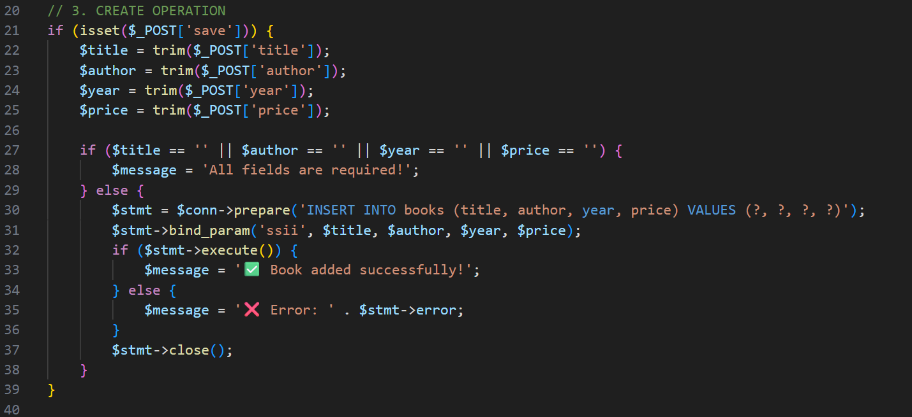
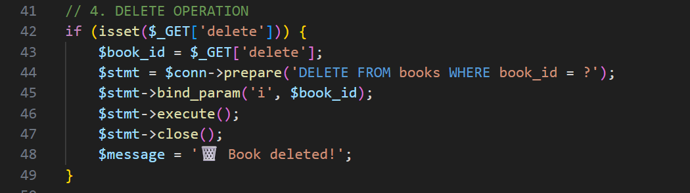

# 24RP12926_Assignment5

### CONNECTION
Database Connection

Establishes connection to MySQL using MySQLi.
Checks for connection errors and stops execution if failed.

### CREATE OPERATION

Create (Add Book)

Triggered when user clicks “Add Book”.
Validates inputs are not empty.
Uses prepared statements to insert data.
Displays success or error message.

### DELETE OPERATION 

Triggered when user clicks delete link.
Deletes the selected book by book_id.
Asks for confirmation before deletion.

### FORM FOR OUTPUT

The form includes input fields for title, author, year, and price.
Also includes feedback message

### TABLE THAT DISPLAY THE OUTPUT ONCE SELECTION IS DONE

